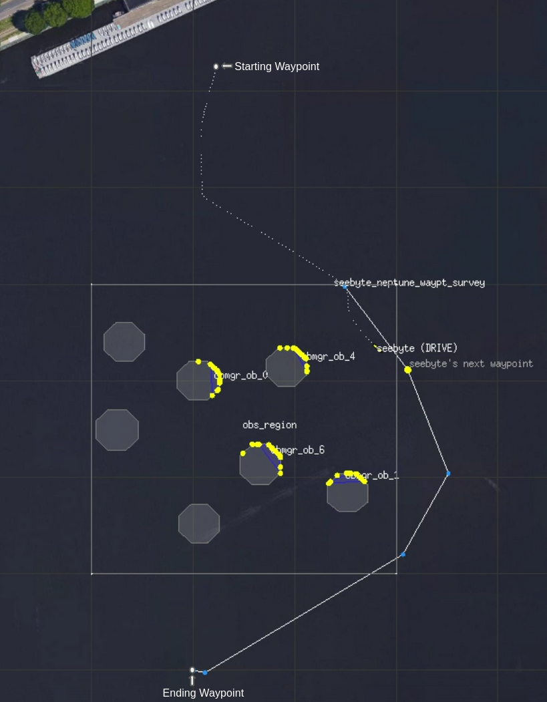
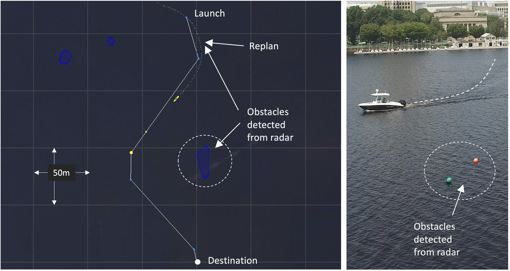

Feedback Control
================

<!-- WARNING: THIS FILE WAS AUTOGENERATED! DO NOT EDIT! -->
<table style="margin: 0 auto" rules="none">
<tr>
<td>

</td>
<td>

</td>
</tr>
</table>
<table style="margin: 0 auto" rules="none">
<tr>
<td>

</td>
</tr>
</table>

Teaching semester: SPRING 2023

Language of instruction: Italian and English

## Course coordinator

Andrea Munafo

## Lecturer(s)

Andrea Munafo

## Install

The notebooks run with python 3.9 and use the following python
libraries: - sympy - python control - numpy - pandas - matplotlib -
opencv-python

Notebook `01_Getting_started_with_Python_and_Jupyter_Notebook.ipynb`
provides a short introduction on how to set up an anaconda environment
to get you started.

To use all notebooks you might need to install the feedback control
package. You can do this entering this into your terminal:

    pip install -e '.[dev]'

This is the recommended way to make a Python package importable from
anywhere in your current environment:

- `-e` – short for “editable”, lets you immediately use changes made to
  your package during development.
- `.` – refers to the current directory.
- `[dev]` – includes “development” requirements: other packages that
  your notebooks use solely for documentation or testing.

## How to use

Each notebook is thought to be independent from every other, so it is
possible to run them in any order you prefer.

## Acknowledgements and references

- Images above are from the paper *Conlan Cesar, Benjamin Whetton,
  Michael DeFilippo, Michael Benjamin, Michael Sacarny, Scott Reed,
  Andrea Munafo, Coordinating Multiple Autonomies to Improve Mission
  Performance, OCEANS 2021 MTS/IEEE, October, 2021*

- *Some of the images and content used in the notebooks have been based
  on resources available from
  [engineeringmedia.com](https://engineeringmedia.com/map-of-control).
  The website and the youtube videos are a fantastic resource on control
  systems.*

- The pendulum example is inspired by [Control tutorials for Matlab and
  Simulink](hhttps://ctms.engin.umich.edu/CTMS/index.php?aux=Activities_Pendulum)

- Relevant textbooks used to prepare these notebooks are reported in
  `00_Syllabus.ipynb`.

## Additional resources

- [Control systems academy](http://www.controlsystemsacademy.com/)
- [Process Dynamics and Control in
  Python](https://apmonitor.com/pdc/index.php)
- [Karl J. Åström and Richard M. Murray, Feedback Systems: An
  Introduction for Scientists and
  Engineers](http://www.cds.caltech.edu/~murray/amwiki/index.php/Main_Page)
- [Lecture series on Control Engineering by Prof. Madan
  Gopal](https://www.youtube.com/playlist?list=PLghJObT_RyfLmKRT86TquJhG6QuiHZ6Pi)
- [Designing Lead and Lag Compensators in Matlab and
  Simulink](https://ctms.engin.umich.edu/CTMS/index.php?aux=Extras_Leadlag)

------------------------------------------------------------------------
